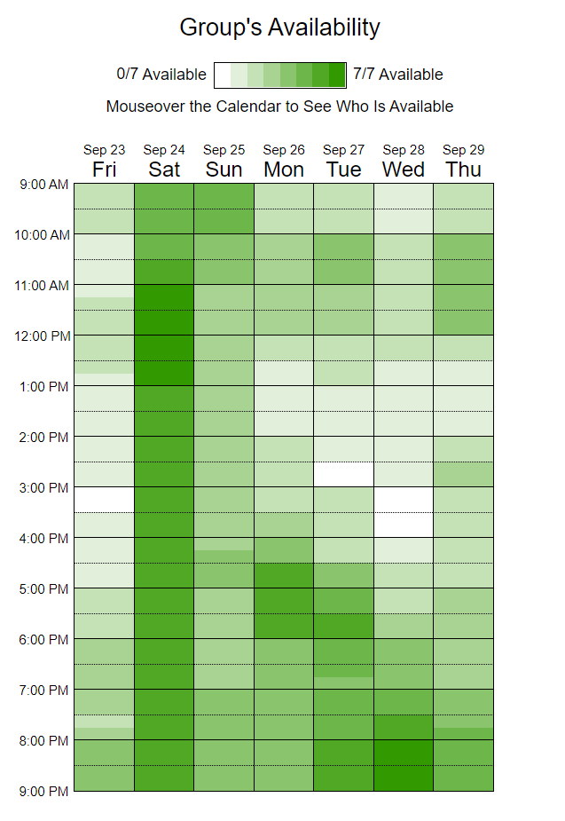

# My Party Album
> _Note:_ This document is meant to evolve throughout the planning phase of your project.   That is, it makes sense for you commit regularly to this file while working on the project (especially edits/additions/deletions to the _Highlights_ section). Most importantly, it is a reflection of all the planning you work you've done in the first iteration. 
 > **This document will serve as a master plan between your team, your partner and your TA.**

## Product Details
 
#### Q1: What are you planning to build?

We are building a photo editor for the general users of the app, and include an array of features. The existing application itself is a mobile application on both Android and IOS platforms, and we are going to be building a photo editor that enables users to edit their photos with various functionalities.

A feature that any basic photo editor should have is the ability to choose a photo from the photo album and enter edit mode with it. This will also be one of the features that we will implement for this application, as it is not currently in place. The following [mockups](https://mockittapp.wondershare.com/app/2e9146100ac43cd1ff39cf655654788d7edc56e7?simulator_type=device&sticky) created by our team demonstrates this feature. From the photo album (left), when a user clicks into a specific image, the user will be able to select the edit button on the top right hand corner to enter the edit mode.

  &nbsp; &nbsp; &nbsp; &nbsp;&nbsp; &nbsp; &nbsp; &nbsp;&nbsp; &nbsp; &nbsp; &nbsp;&nbsp; &nbsp; &nbsp; &nbsp;
 
 

 
Once the user enters the photo editor, he/she is able to perform various actions such as adding stickers (including emojis), multiple filters, text, cropping, drawing, saving drafts, and undo/redoing. These [mockups](https://xd.adobe.com/view/20a602dd-9639-444e-bf54-c31357246d66-75f5/) (from the partner) show how the photo editor will look like: 

 &nbsp; &nbsp; &nbsp; &nbsp;&nbsp; &nbsp; &nbsp; &nbsp;&nbsp; &nbsp; &nbsp; &nbsp;&nbsp; &nbsp; &nbsp; &nbsp;

#### Q2: Who are your target users?

Our target users are anyone who is using the application! After discussions with the partner, we found out that...
* Android mobile users make up approximately 90% of the application's users.
* People from India and Bangladesh make up most of the user base as they use Android more and the goals of My Party Album align with their motivation of having better privacy in place.
* The main target audience is people who are attending weddings as it would be very difficult to connect everyone and share photos individually without My Party Album.
However, our target users are still general users since the photo editor should be a general application that is easily used by anyone.

Here are some personas that we have created that represent some of our target users:

**Persona 1**
Dhruv, a 25 year old Android user from India who values privacy and wants to edit and share photos with family and friends. He is a businessman and he travels a lot around the country. Due to lesser time spent with friends and family, he wants to share want he encounters in his everyday life and he wants to edit the photos by adding funny text or stickers to them before quickly and securely sharing them. 

**Persona 2**
Betty, a 29 year old from Canada whose wedding is in a few weeks. Over 200 friends and family have been invited to attend the wedding, and she wants to collect all the pictures and videos taken by family and guests at the wedding. She has hosted big events in the past but it was always difficult to get in contact and ask every single attendee. She wishes she won't need to spend all that time after her wedding doing the same thing.

#### Q3: Why would your users choose your product? What are they using today to solve their problem/need?

We have all tried to edit and share photos that we have taken with our friends, but it is a huge hassle. We have to retroactively select photos from your device's gallery, edit them in one app, create a folder on another, and then finally send the link to every single friend on 5 different messaging apps. Could you imagine how bigger of a problem this is when you want to share it with over 100 people?

MyPartyAlbum is a one-stop photo sharing application that solves this. It's convenience, and its privacy and quality-first mission differentiates it from other apps out there. Users can quickly edit photos they have just taken, and instantly share it with everyone. With our photo editor, users focus their attention on how to perfect the moment they have captured, show off their creativity and express themselves in the photo.

#### Q4: How will you build it?

MyPartyAlbum exists on both iOS and Android platforms. On Android, it is built using Java and Android studio, and on iOS with Swift and Xcode. 
We will consider using the MVC design pattern to separate our UI and the logic behind editing a photo, and to ensure it is easily maintainable for the future.
In addition to design patterns, we will be looking into libaries that can [add emoji support](https://github.com/vanniktech/Emoji), apply effects on photos, etc.
We will be testing our product by writing unit tests, and using the editor a lot ourselves. We will also work closely with our partners, and have their team try to the features we have added.

NOTE: Architecture and deployment will be added once our partners share their code repository with us. 

MVVM architecture for the photo editor: https://drive.google.com/file/d/1QGS07RJShMvSDeHo72m7Wcxrc9fAe90D/view?usp=sharing

#### Q5: What are the user stories that make up the MVP?

[Link to the user stories](https://docs.google.com/document/d/1R6xfl1Ap9-hy0H3RxjM9aO0ZC-OGVUaXcQbmuWjRO_g/edit?usp=sharing)

Partner approval was seeked during a zoom meeting and the feedback was given in the meeting minutes (see Q8 below for link). We have refined the user stories based on the feedback and ranked them based on priority given by the partner, reflected by the order in the Google doc (most important to least).

----
## Intellectual Property Confidentiality Agreement 
With regards to the UofT student engagement with My Party Album Inc., it is a greed that:
1. Any software code or resources shared by My Party Album Inc., will not be reproduced,
transmitted, shared, or copied for personal gain by any of the UofT team members working on
the project.
2. Code and application functionality developed by the UofT team members for My Party Album
application solution, is the property of My Party Album Inc.
3. The UofT team members may not reproduce an application solution like My Party Album for
their own personal gain for 5 years from the end of the engagement.
4. The UofT team members may reference and share the work they specifically developed for
proof of development in future.
5. If any of the UofT team members work for an established company where they are to develop
functions like the My Party Album application solution, My Party Album Inc will not impede,
block, or interfere with the UofT team members employment opportunity. Examples:
- Hired by a Social Media firm like Instagram
- Hired by a company that has a photo capture and editing feature, or wants to
incorporate a photo editing feature

----

## Process Details

#### Q6: What are the roles & responsibilities on the team?

#### Non-Technical Roles:
**Product Owner**
- Liase with and get input from partner, then translate them to technical requirements/tasks for the team

**Scrum Master**
- Facillitate standups/ meetings
- Ensure that developers have no blockers (remove blockers between teams)

**UI designers**
- Prototyping using figma or other mockup tools
- Designing icon and symbols appear on user interface. 
- Designing of the user interface after the addition of new features. 

**Team leaders (of a specific user story)**
- _Note: We do not have a stagnant team. Everyone chooses which user stories they want to work on and there is one team per user story. Hence, one developer can be on multiple teams._
- Break down the user story into multiple user stories if he/she realizes that the user story is becoming too big.
- Ensure that team members are on track, in terms of whether they are in the correct direction and provide feedback and help (not necessarily technical) if necessary.
- Communicate actively with the rest of the team to ensure that the user story is able to be accomplished in time by managing the task allocation based on team members' capacity.

**Scribe**
- Ensure that meeting minutes are taken for every meeting (as a team and with the partner).

**Facilitator**
- Set agenda for each non-coding related meeting sessions (e.g. to discuss deliverables, feedback from partners)
- Making sure the meeting stays in track and ensure that all agendas are met before the end of the meeting.

**Moderator**
- Ensure that all team members attend meetings.
- Update the csv file on member's participation after every meeting.

#### Technical Roles:

**Android Developers**
- Implement the user stories on Android platforms.
- Ensure tasks are completed on time.
- Review code written by other developers before it is merged with the main branch.
- Communicate actively with the team leader regarding his/her progress and if they have sufficient capacity to finish the tasks at hand.

**IOS Developers**
- Implement the user stories on IOS platforms.
- Ensure tasks are completed on time.
- Review code written by other developers before it is merged with the main branch.
- Communicate actively with the team leader regarding his/her progress and if they have sufficient capacity to finish the tasks at hand.

#### Members:

| Team member:      | Michael Ng | 
| :---       |    :---   |
| Role(s) Responsibilities |    - Product Owner   - Android Developer   - IOS Developer    | 
| Components to work on   | -  Implement undo features while editing photos.   - Implement the ability to apply multiple filters at once in the editor.   - Implement the ability to edit existing photos in the album. | 
| Non software related work   | - Meet with partners weekly to discuss priorities and clarify requirements as the product owner.   - Translate and break down requests into technical requirements and tasks.   | 
| 3 technical strengths and weaknesses  |   *Strengths:*   - Java, Python   - Familiar with Agile, Scrum   - Experience with Unit and Integration testing      *Weaknesses:*   - New to mobile development   - New to iOS development (Swift)   - UI design     | 

---

| Team member:      | Brian Ho | 
| :---       |    :---   |
| Role(s) Responsibilities |    - Android Developer   - IOS Developer    | 
| Components to work on   | - Implement undo button in editor   - Implement the function of drawing on photots   - Implement the function of  adding stickers, filters and text with different fonts and sizes   | 
| Non software related work   | - Liase with partner and design technical tasks according to the partner's requirement for the team as the product owner   - Ensure that team members are on track as a Team Leader for some user story   | 
| 3 technical strengths and weaknesses  |   *Strengths:*   - Java   - Python   - C/C++   - Some experience in webapp development    *Weaknesses:*   - Unfamiliar with agile methodology   - Unfarmiliar with iOS development   - UI design |

---

| Team member:      | Syeda Areej Faisal Naqvi | 
| :---       |    :---   |
| Role(s) Responsibilities |    - Android Developer   - IOS Developer    | 
| Components to work on   | - Implement the function of adding stickers, filters and text with different fonts and sizes.   - Implement the ability to apply multiple filters at once in the editor.   - Implement function of drawing on photos in the editor. | 
| Non software related work   |     - UI designer to create mockups and seek partner's approval     - Ensure that team members are on track as a Team Leader for some user story   - Liase with partner as product owner   - Take meeting minutes (for meetings within the team, and meetings with partner) as a scribe.  | 
| 3 technical strengths and weaknesses  |   *Strengths:*   - Java   - Python   - C/C++      *Weaknesses:*   -  Unfamiliarity with mobile development   - Swift   - Unfamiliarity with Agile methodology   | 

---

| Team member:      | Kehui Li | 
| :---       |    :---   |
| Role(s) Responsibilities |    - Android Developer   - IOS Developer    | 
| Components to work on   | - Implement the function of cropping images in the photo editor.   - Implement the function of  adding stickers, filters and text with different fonts and sizes.  -Able to save a draft of the photo in the editor.  | 
| Non software related work   |     - UI designer to create mockups and seek partner's approval    - Ensure that all team members attend meetings.   - Update the csv file on member's participation after every meeting as the moderator.  | 
| 3 technical strengths and weaknesses  |   *Strengths:*   -Python   -Java    -C++/C    *Weaknesses:*   - Unfamiliar for mobile development   - Unfamiliar with database    | 

---

| Team member:      | Valerie Fang Hong Yip | 
| :---       |    :---   |
| Role(s) Responsibilities |    - Android Developer   - IOS Developer    | 
| Components to work on   | - Implement the function of  adding stickers, filters and text with different fonts and sizes.   - Implement the ability to apply multiple filters at once in the editor.    - Implement function of drawing on photos in editor  | 
| Non software related work   |    - Facilitates meetings as a facilitator     - Ensure that team members are on track as a Team Leader for some user story  | 
| 3 technical strengths and weaknesses  |   *Strengths:*   - Python   - Java   - Familiarity with Agile methodology      *Weaknesses:*   - Mobile development processes   - UI/UX design   - Swift      | 

---

| Team member:      | Howard He | 
| :---       |    :---   |
| Role(s) Responsibilities |    - Android Developer   - IOS Developer    | 
| Components to work on   | - Implement the function of  adding stickers, filters and text with different fonts and sizes.   - Implement the function of cropping images in the photo editor. - Able to save edited photos to the Album.   | 
| Non software related work   | Faciliator  - Schedule meetings and plan out the general discussion topic   - Actively communicate with team members to ensure that they can meet at a time that works for them| 
| 3 technical strengths and weaknesses  |   *Strengths:*   - Python   - Java - C  *Weaknesses:*   - Unfamiliar with mobile development   - UI/UX design  - Unfamilar with Agile framework    | 

---

| Team member:      | Junsong Guo | 
| :---       |    :---   |
| Role(s) Responsibilities |    - Android Developer   - IOS Developer    | 
| Components to work on   | - Implement undo features while editing photos.   - Implement the function of  adding stickers, filters and text with different fonts and sizes.    - Implement function of drawing on photos in editor  | 
| Non software related work   |   - Plan sprints as a Scrum master   | 
| 3 technical strengths and weaknesses  |   *Strengths:*   - Python   - SQL   - Some experience with React      *Weaknesses:*   - Mobile development especialy on IOS   - Graph databases   - UI/UX design     |

#### Q7: What operational events will you have as a team?

We are planning to hold ad-hoc meetings at the start (before we officially start working on the code) and these meetings are usually held before and after a meeting with the partner, for the product owners to update the team on the partner's feedback, and to discuss aspects of the deliverables that need to be completed.

When we officially start to work on the user stories, we will have many subteam meetings which are organized between the people who are working on the same user stories/ features. This will mainly be self-organized. Apart from these coding sessions, we will have a quick weekly full team standup for the Scrum Master to check in on everyone. Here, each of us will provide a progress on the tasks at hand and talk about any blockers that we have.

The meetings are all held online via discord, which is also the main platform that facilitates our communication.

##### Meeting with partners:
The first meeting we had with the project partner is to discuss the details of the project and the features that the partner would like us to implement. During the meeting, we clarified most of our questions related to the product  itself and had a better idea of what user stories to come up with. We also discussed administrative issues, such as what we need to 

The second meeting was to get feedback from the partner regarding our understanding of their requirements. We showed them the user stories that we have came up with and received feedback to refine our acceptance criteria.

The meeting minutes can be found [here](https://docs.google.com/document/d/1o5j1pMHU8YmygSgWoiKFKgz6d2AOQIhuWnq_eDV3MTo/edit?usp=sharing), which is also linked as one of the artifacts that we use to self-organize.

We have decided on a regular meeting schedule with the partner, which is every Friday from 4:30pm to 5:00pm. These meetings will be important for us to give updates on our progress and for them to provide feedback, to make sure that we are all on the same page.

#### Q8: What artifacts will you use to self-organize?

We will be using [Google docs](https://docs.google.com/document/d/1o5j1pMHU8YmygSgWoiKFKgz6d2AOQIhuWnq_eDV3MTo/edit?usp=sharing) for meeting minutes to keep track of what has been discussed. 

We are using when2meet to decide on a common time to meet regularly. We have decided on holding our Scrum meetings every Saturday at 11:00am as can be seen from the following when2meet: 

We will be using a kanban board to organize our tasks. The exact platform has not been decided or set up, but the Scrum Master will set it up before we start working on the user stories. We are likely to use Jira. There will be a "to-do" column which contains all the tasks under each user story, an "in progress" column to keep track of who is working on which tasks. There will also be a "blocked" column for developers to indicate any tasks that they have blockers on. Lastly, there will be a "done" column. The board will allow us to visualize the status of each tasks.

We will prioritize tasks based on urgency and priority given by the partners. During the meetings with the partner, we took notes on which features they desire the most. We will prioritize those features first, while taking into account the difficulty and deadline of deliverables.

We will asign the tasks based on team members' interests and capacity (time available to perform the tasks). Each team member gets to choose the user stories that they are interested in working and one person is given the ownership of that user story. Then, the "owner" of the story will be the team leader and he/she will break the story into chunks of tasks. We will estimate the time required for each task and team members will pick up tasks based on their capacity for the upcoming week. Going forward, we will be relying a lot on self-organization.

Lastly, we will determine the status of work based on whether the acceptance criteria of the user story has been satisfied. Members that are not working on the current user story will be involved in testing our the user experience with regards to using the new feature, and provide feedback on whether the acceptance criteria has been met.

#### Q9: What are the rules regarding how your team works?

The main channel of communication for the team is Discord. Meetings will be held at 11am on Saturday to discuss the plan for the upcoming week, including but not limited to discussing progress and task delegation. The team is also continuously in contact with each other before on Discord allowing for collective problem solving. The team will choose a deadline by which a certain set of tasks are to be completed, and everyone checks in on the day of the deadline to ensure that the required work has been done. All meetings within the team will be held on Discord.

We have also scheduled a recurring meeting with the partner every Friday at 4:30pm on Microsoft Teams to update them on the progress of the project. Any questions or concerns that arise in the meantime will be raised to the partner through email. The team will also meet on Discord after partner meetings to bring everyone up to speed to any development that may have occurred during the meeting with the partner. 
 
**Meetings:**

As mentioned previously, group meetings are scheduled using [when2meet](https://www.when2meet.com), at 11am every Saturday. The moderator will ensure that all members are present at each meetings, and will be responsible for updating the csv file on member participation following each meeting. Moreover, each user story is assigned an owner who is responsible for overseeing its implementation. If multiple people are working on a user story, the owner is in charge of ensuring that everyone completes their assigned tasks.

----
## Highlights

### Splitting the team into small groups
During our meeting, we came up with different ways to split our team into smaller groups. 

Since our product runs on both Android and iOS, our first idea is to split our group into an android team and an iOS team. An advantage is that each person could work with only one language (either Java or Swift) through the project. However, this would potentially lead to inconsistent performance between Android and iOS version. Also, most of our team members are more familiar in Java and almost none in our team has iOS dev experience, so this lead to our current option.

We decided to split the team by different user stories. Each user story will be assigned to a group which is comprised of 1-3 members, and each one of us gets to choose the features which we want to develope. The group will implement the feature in both Android and iOS versions so that the same feature will behave the same way in both systems, and everyone has a chance to learn a new language.

### Prioritizing core features
After dicussing with our partner, we decided the "core" featuers for our filter. In our first version of the filter, we would including the following features:

- Adding stickers, filters, text
- Applying multiple filters
- Undo
- Cropping
- Drawing
- Integrate emojis as one of the ‘stickers’ you can add

We place less priority on these features since they are more complex than necessary and difficult to merge with existing app features:
- Redo
- Saving drafts

### Choosing platform to organize user stories
When dicussing the platform to organize our user stories, we first considered GitHub issue and GitHub project board as all of us are experienced GitHub users, and it is more convenient since we also use GitHub as our primary version control platform.

However, due to the lack of project management features in GitHub and the agile nature of the project, we chose Jira as the user story managing platform since Jira provides more features for project management. 

The scrum master will set up the jira platform shortly after D1 is due.

